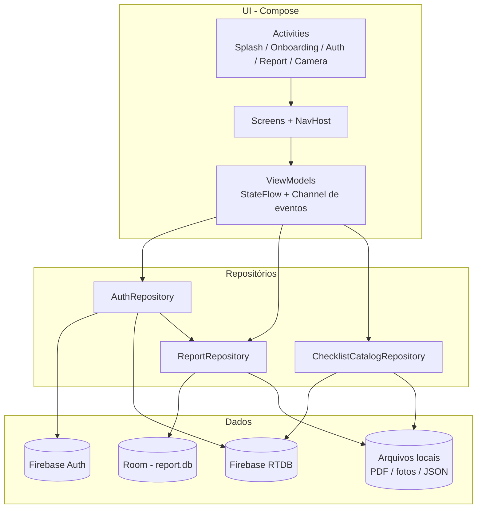
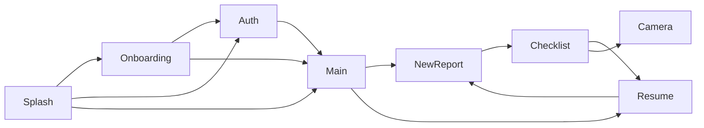

# ReportForm

App Android de **relatórios de inspeção / auditoria**. O auditor autentica, preenche um checklist com conformidade, fotos e notas, vê a pontuação e exporta um PDF para compartilhar.

Há duas variantes de publicação: **Report Lite** (com anúncios) e **Report** (paga, sem ads).

| | |
| --- | --- |
| Pacote | `com.rendersoncs.report` |
| Versão | `2.0.0` (`versionCode` 8) |
| minSdk / targetSdk / compileSdk | 24 / 37 / 37 |
| Linguagem | Kotlin 2.4, JVM 17 |
| UI | Jetpack Compose + Material 3 |

---

## O que o app faz

1. **Cadastro e login** com e-mail e senha (Firebase Auth).
2. **Catálogo de itens** de checklist por usuário, sincronizado com o Firebase Realtime Database e cache local em JSON.
3. **Novo relatório** com empresa, e-mail do cliente, data e responsável.
4. **Checklist** com três respostas: Conforme (C), Não se aplica (NA) e Não conforme (NC). Itens NC exigem foto para concluir.
5. **Pontuação** automática: começa em 10 e perde 0,7 por NC. Resultado **CONFORME** se a nota for ≥ 5.
6. **PDF nativo** gerado na conclusão, com cabeçalho, itens, notas e fotos.
7. **Dashboard** para filtrar, reabrir rascunhos, ver resumo, compartilhar ou excluir.
8. **Perfil** com tema claro/escuro, troca de senha, exclusão de conta e logout.

Idiomas: inglês (padrão), português (`values-pt`) e espanhol (`values-es`).

---

## Flavors

Dimensão Gradle `version`:

| Flavor | Application ID | Nome | Ads |
| --- | --- | --- | --- |
| `free` | `com.rendersoncs.report.free` | Report Lite | Interstitial AdMob ao concluir o checklist |
| `paid` | `com.rendersoncs.report.paid` | Report | `AdManager` é no-op |

O `FileProvider` também é distinto por flavor (`…free.FileProvider` / `…paid.FileProvider`), para compartilhar PDFs.

---

## Stack

| Área | Tecnologia |
| --- | --- |
| Build | AGP 9.3.1, Gradle 9.5, Version Catalog (`gradle/libs.versions.toml`) |
| UI | Compose BOM 2026.08, Navigation Compose, Material 3 |
| DI | Hilt 2.60 |
| Local | Room 2.8 (`report.db`) |
| Remoto | Firebase Auth, Realtime Database, Crashlytics, Cloud Messaging |
| Câmera | CameraX 1.6 + `camera-compose` |
| PDF | `android.graphics.pdf.PdfDocument` (sem lib externa) |
| Imagens | Glide |
| Ads | Google Mobile Ads (flavor `free`) |
| Qualidade | Detekt 1.23 |

---

## Arquitetura

O app segue **MVVM + Repository**, com UI 100% Compose. Activities só hospedam o `NavHost`; a lógica vive nos ViewModels.



### Responsabilidades

- **Screen** — layout, navegação e coleta de `StateFlow` / eventos.
- **ViewModel** (`@HiltViewModel`) — estado da tela, validação, pontuação e orquestração. Expõe `uiState` e um `Channel` de eventos one-shot (snackbar, PDF, logout).
- **Repository** — acesso a Room, Firebase e arquivos. Sem Compose.
- **`UiState<T>`** — `Loading` / `Empty` / `Success` / `Error` para listas.

Hilt injeta o banco, repositórios e `ThemeSettings` em `AppModule` (`SingletonComponent` + `ViewModelComponent`).

---

## Fluxo do usuário



1. **`SplashScreenActivity`** (launcher) — se há sessão Firebase, vai para o app; se é a primeira instalação, onboarding; senão, login.
2. **`OnboardingActivity`** — três páginas (relatórios, checklist, PDF). Marca `OnboardingPrefs` e não volta a aparecer.
3. **`AuthActivity`** — login, cadastro, recuperação de senha.
4. **`ReportActivity`** — `HomeScreen` com abas **Auditorias** e **Perfil**.
5. Relatório **não concluído** abre o checklist; **concluído** abre o resumo.
6. **`CameraActivity`** — captura avulsa, devolve o arquivo para o item do checklist.

---

## Pacotes

```
com.rendersoncs.report
├── ui/                     # Compose, Activities, tema, navegação
│   ├── splashscreen/
│   ├── onboarding/
│   ├── login/              # AuthActivity + AuthNavHost
│   ├── dashboard/          # Home, lista, busca, filtros
│   ├── newreport/
│   ├── checklist/
│   ├── resume/
│   ├── camera/
│   ├── profile/
│   ├── navigation/         # ReportNavHost + rotas
│   ├── theme/              # cores, tipo, shapes, ThemeSettings
│   └── components/         # botões, snackbar, FAB
├── repository/             # Auth, Report, ChecklistCatalog
├── data/
│   ├── local/              # Room: AppDatabase, ReportDao, relations
│   └── net/                # FCM (NotificationFireBase)
├── model/                  # Report, ReportCheckList, User, ReportResumeItems
├── di/                     # Hilt modules
└── common/
    ├── constants/
    ├── pdf/                # PDFGenerator + PdfCanvasWriter
    └── util/               # arquivos, e-mail, prefs do usuário
```

Convenção de UI: nos composables do pacote `ui`, `modifier` é o **primeiro parâmetro**.

### Rotas principais (`ReportNavHost`)

| Rota | Tela |
| --- | --- |
| `dashboard` | Home (Auditorias + Perfil) |
| `new_report?reportId=` | Novo relatório ou edição dos metadados |
| `checklist/{reportId}` | Preenchimento do checklist |
| `resume/{reportId}` | Resumo, PDF, exclusão |
| `settings` | Sobre |
| `change_password` | Troca de senha (reautenticação Firebase) |
| `delete_account` | Exclusão de conta |

Auth (`AuthNavHost`): `auth/login`, `auth/sign_up`, `auth/forgot_password`, `auth/recovery_sent`.

---

## Persistência

### Room (`report.db`)

| Entidade | Tabela | Papel |
| --- | --- | --- |
| `User` | `User` | Só o `userId` (uid do Firebase), para amarrar relatórios |
| `Report` | `all_reports` | Empresa, e-mail, data, responsável, score, result, `concluded` |
| `ReportCheckList` | `ReportCheckList` | Resposta por item: key, título, nota, foto, conformity |

Relação `ReportWithCheckList`: um relatório tem N itens. Migração destrutiva (`fallbackToDestructiveMigration`).

### Arquivos locais

Pasta `Android/data/<applicationId>/files/Documents/Report/`:

| Arquivo | Uso |
| --- | --- |
| `{empresa}-{data}.pdf` | PDF do relatório concluído |
| `{uid}.json` | Cache do catálogo de checklist |
| `photos/photo_{timestamp}.jpg` | Fotos da câmera |

Compartilhamento via `FileProvider` (`res/xml/provider_paths.xml`).

### SharedPreferences

- Tema claro/escuro (`preference_theme`).
- Onboarding concluído (`onboarding_prefs`).
- Nome / e-mail / foto do perfil (espelho da sessão).

---

## Firebase

A sessão **Firebase Auth** é a fonte do uid. Depois do login/cadastro, o app:

1. Grava `User(userId)` no Room.
2. Atualiza `users/{uid}/credential` no Realtime Database (nome, e-mail, foto, cargo no cadastro).
3. Lê/grava o catálogo em `users/{uid}/list`.

```
users/
  {uid}/
    credential/     # perfil
    list/           # itens do checklist (title, description, key)
```

- **Crashlytics** — exceções de auth, catálogo e PDF; coleta desligada no manifesto até ser habilitada no console.
- **FCM** — `NotificationFireBase` exibe notificações remotas.

`google-services.json` precisa estar em `app/` (não versionado neste repositório).

---

## Checklist e pontuação

O catálogo vem da nuvem quando há internet; sem rede, usa o JSON em disco. Incluir, editar ou remover item extra **exige conexão**.

Cada item aceita:

| Código | Resposta |
| --- | --- |
| `1` | Conforme (C) |
| `2` | Não se aplica (NA) |
| `3` | Não conforme (NC) |
| `-1` | Sem resposta |

Regras:

- Nota inicial **10**. Cada NC desconta **0,7** (mínimo 0).
- **CONFORME** se score ≥ **5**; senão **NÃO CONFORME**.
- Conclusão exige pelo menos um item respondido.
- Todo NC precisa de **foto**.
- Autosave a cada **60 s** se houver mudanças.
- Sair sem nenhuma resposta **apaga** o relatório órfão.

Na flavor `free`, um interstitial AdMob pode aparecer ao concluir (IDs em `app/src/main/resources/secrets.properties`).

---

## PDF

`PDFGenerator` monta o arquivo com `PdfCanvasWriter` (`PdfDocument` + Canvas):

- Cabeçalho com empresa, data, responsável e resultado.
- Card por item (conformidade, descrição, nota, foto se houver).
- Nome no padrão empresa + data.

Abrir/compartilhar usa `Intent` + `FileProvider`. Relatórios não concluídos não geram PDF.

---

## Câmera

`CameraActivity` + CameraX:

- Preview Compose, captura, retake e confirmação.
- Troca frente/traseira quando há duas câmeras.
- Botão de volume dispara a foto.
- Ícones da system bar claros (preview escuro).
- Resultado volta para o checklist (`REQUEST_CAMERA_X`).

---

## Tema

Paleta Stitch em `ui/theme`:

- Primary navy `#102A43`
- Secondary `#2196F3`
- Títulos **Hanken Grotesk**, corpo **Inter** (Google Fonts)
- Claro e escuro via `ThemeSettings` + `AppCompatDelegate`

`ReportTheme` ajusta status bar e navigation bar: ícones **escuros** no light e **brancos** no dark.

---

## Como rodar

### Pré-requisitos

- Android Studio compatível com AGP 9 / JDK 17
- `google-services.json` em `app/`
- `keystore.properties` na raiz (assinatura; ver `.gitignore`)
- Flavor `free`: `app/src/main/resources/secrets.properties` com `ADMOB_HLG_PUB` e `ADMOB_PROD_PUB`

Exemplo de `keystore.properties`:

```properties
keyAlias=...
keyPassword=...
storeFile=...
storePassword=...
```

### Gradle

```bash
./gradlew :app:assembleFreeDebug
./gradlew :app:assemblePaidDebug
./gradlew :app:bundleFreeRelease
./gradlew :app:bundlePaidRelease
```

A Play Console recebe o **Android App Bundle** (`.aab`), não o APK. Os bundles saem em `app/build/outputs/bundle/freeRelease/` e `app/build/outputs/bundle/paidRelease/`.

Release usa **R8**: ofuscação, shrinking de código e de recursos. O mapping (para o Crashlytics e para a Play Console) fica em:

- `app/build/outputs/mapping/freeRelease/mapping.txt`
- `app/build/outputs/mapping/paidRelease/mapping.txt`

Guarde o `mapping.txt` de cada `versionCode`. Sem ele, stack traces ofuscados não voltam ao código original. O plugin do Crashlytics envia o mapping no build de release.

Detekt:

```bash
./gradlew :app:detekt
```

---

## Permissões

| Permissão | Motivo |
| --- | --- |
| `INTERNET` / `ACCESS_NETWORK_STATE` | Auth, RTDB, catálogo, ads |
| `CAMERA` | Evidências do checklist (`required`) |
| `POST_NOTIFICATIONS` | FCM |

---

## Mapa mental do código por tela

| Tela | ViewModel | Dados |
| --- | --- | --- |
| Login / cadastro / recovery | `AuthViewModel` | `AuthRepository` |
| Auditorias | `DashboardViewModel` | Room + FileProvider |
| Perfil | `ProfileViewModel` | Auth, RTDB, `ThemeSettings` |
| Novo relatório | `NewReportViewModel` | Room + prefs do responsável |
| Checklist | `ChecklistViewModel` | Catálogo Firebase + Room |
| Resumo | `ResumeViewModel` | Room + PDF |
| Câmera | `CameraViewModel` | arquivo local |

`MyApplication` (`@HiltAndroidApp`) aplica o tema salvo e inicializa o AdMob.
